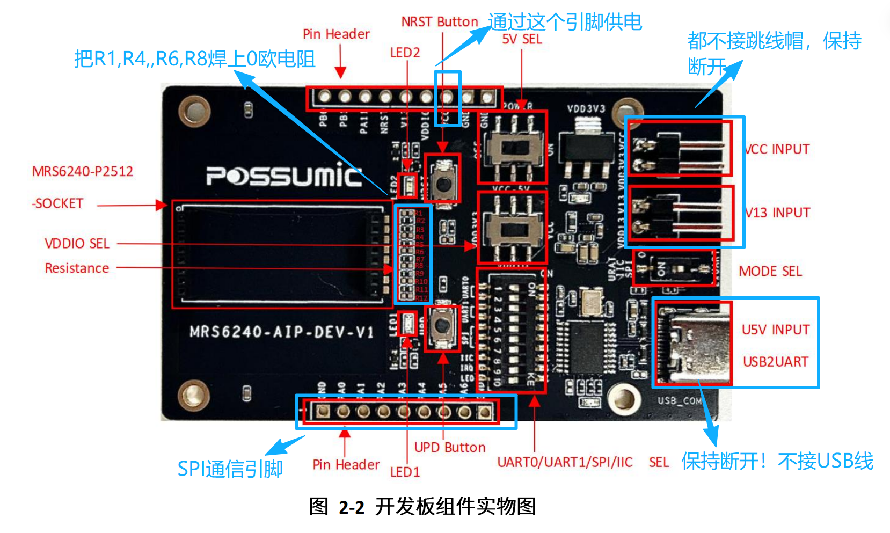
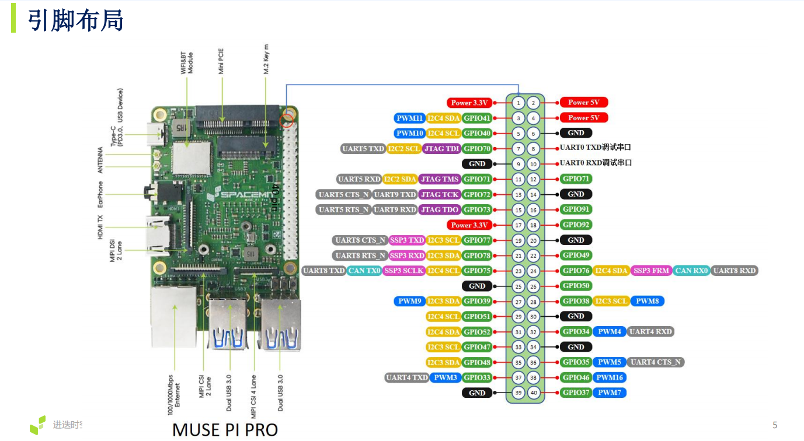
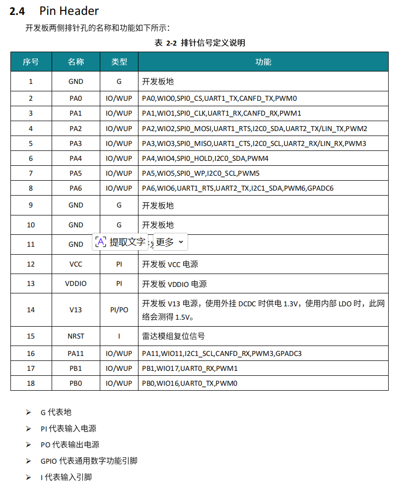

# MRS6240 (正和微芯) 毫米波雷达 — Linux SPI 数据采集

> 仓库：[MRS6240_mmWave_radar_spi_collect_data_linux](https://github.com/winwin52/MRS6240_mmWave_radar_spi_collect_data_linux)

**一句话**：在 Linux（MUSE Pi Pro / 进迭时空 K1 / 树莓派等）上，通过 SPI 直连正和微芯 MRS6240 毫米波雷达，运行 Python 脚本采集原始点云与呼吸信号数据。**不需要 Windows、不需要 CH347 USB 桥、不需要官方上位机**。

---

## 硬件简介

### MUSE Pi Pro（进迭时空）

进迭时空 K1 MUSE Pi Pro 是一款 RISC-V 单板计算机，运行 Bianbu Linux（内核 6.6）。40pin GPIO 引出 SPI、I2C、UART 等接口，3.3V 电平，适合嵌入式传感器开发。

> 本项目脚本运行在 Linux + Python + spidev 上，理论上适配任何带 SPI 控制器的 Linux SBC（树莓派等），只需调整 SPI 总线号和 GPIO 编号。

### MRS6240 毫米波雷达（正和微芯）

珠海正和微芯 POSSUMIC MRS6240 — 2T4R MIMO 毫米波雷达模组，RS6240 芯片，RISC-V 双核（CPUS+CPUF），最高 256MHz。SDK 提供预编译固件 `r3_databox`，通过 HIF 协议走 SPI 从机模式上报点云数据。

---

## SPI 通信逻辑

### 主从角色

| 角色 | 设备 | 说明 |
|------|------|------|
| **SPI 主机** | MUSE Pi Pro | 产生 SCLK，发起所有传输 |
| **SPI 从机** | MRS6240 雷达 | SPI Mode 0 (CPOL=0, CPHA=0)，56MHz |

### 通信流程（中断驱动）

```
雷达有数据就绪
  → PA6 (INT) 拉高，通知主机
    → 主机等待 2ms
      → 主机发送 POLL 命令 (HOST_READ 0x0C)
        → 雷达通过 MISO 返回 HIF 数据帧
          → 主机解析帧头（6 字节），跳过 1 字节 DMA 填充
            → 读取 payload + Check32
              → more=1：继续读下一帧
              → more=0：发送 Complete Ack (A5 4B 03 0C 00 00)
                → 雷达 INT 拉低，本轮结束
```

### HIF 帧格式（SPI 线格式，含 DMA 填充）

```
[MAGIC 1B][Check8 1B][MsgHdr 4B][PAD 1B][Payload N B][Check32 4B][PAD 1B]
 ←────────── 7 字节头 ──────────→                    ←── 5 字节尾 ──→
```

关键消息 ID：
- `0x0C` (HOST_READ)：主机轮询命令，触发雷达上报
- `0xC6` (PSIC_DEBUG)：雷达上报的 PSIC 调试数据（含 gain_factor、点云）

详细协议参考 **[docs/hif_protocol.md](docs/hif_protocol.md)**。

---

## 雷达硬件调整（5 步）

### 1. 焊接 R1、R4、R6、R8 电阻

这 4 个 0Ω 电阻连通雷达芯片的 SPI 引脚（PA0–PA3）到 18pin 排针。出厂未焊接，需自行补上（焊锡短接即可，0Ω 本质是导线）。

### 2. 给 18pin 排针孔焊接排针

方便杜邦线连接信号。

### 3. 断开 CH347 USB 连接

开发板上的 CH347 USB-SPI 桥与 18pin 排针共享 PA0–PA3。**USB 必须断开**，否则 CH347 与主机争抢 SPI 总线，导致 MISO 全 0xFF。

### 4. 拔下 VDD3V3 和 VCC 跳线帽

改用外部 3.3V 供电时，需断开板载 LDO。

### 5. K1 3.3V 引脚给雷达供电

K1 的 3.3V 引脚（Pin 1 或 Pin 17）→ 雷达 18pin 排针的 VCC（Pin 12）。



---

## 引脚连接

| MUSE Pi Pro 引脚 | 信号 | 方向 | 雷达 18pin 排针 | 信号 |
|:---:|------|:---:|:---:|------|
| 19 | SPI3_MOSI | → | 4 | PA2 (MOSI) |
| 21 | SPI3_MISO | ← | 5 | PA3 (MISO) |
| 23 | SPI3_SCLK | → | 3 | PA1 (SCLK) |
| 24 | SPI3_CS | → | 2 | PA0 (CS) |
| 22 | GPIO_49 | ← | 8 | PA6 (INT) |
| 6 | GND | — | 1 | GND |
| 1 | 3.3V | → | 12 | VCC |

均为 3.3V 电平，无需电平转换。





**DIP 开关确认**：5/6/7 = ON（SPI 路由到排针），9 = OFF，10 = ON（PA6 = GPIO 中断输出）。

---

## MUSE Pi Pro 配置

### 1. 启用 SPI3 的 spidev（预编译 DTB，最简单）

```bash
# 下载预配置的 DTB（已添加 spidev@0 节点）
wget https://archive.spacemit.com/ros2/prebuilt/brdk_libs/spi/k1-x_MUSE-Pi-Pro.dtb

# 替换原 DTB
sudo cp k1-x_MUSE-Pi-Pro.dtb /boot/spacemit/6.6.63/

# 重启
sudo reboot
```

重启后验证：

```bash
ls /dev/spidev3.0    # 应显示设备节点
```

### 2. 安装 Python 包

```bash
pip install spidev lgpio
```

> `spidev`：Python SPI 用户态驱动（`/dev/spidevX.Y`）
> `lgpio`：Linux GPIO 字符设备 Python 封装（`/dev/gpiochip*`）
>
> 脚本运行时需 `sudo`（SPI 和 GPIO 需要 root 权限）。

---

## 脚本使用

### 采集脚本

**[scripts/collect_r3_databox.py](scripts/collect_r3_databox.py)** — 基于 r3_databox 固件的 SPI 数据采集。

```bash
sudo python scripts/collect_r3_databox.py --speed 10000000
```

**输出**（当前目录下生成两个 CSV）：

| 文件 | 内容 |
|------|------|
| `radar_data_<时间戳>.csv` | 点云数据（运动点云 float32 + 微动点云 int16），含 x/y/z |
| `gain_factor_<时间戳>.csv` | 每距离门增益因子（~520 个值/帧），用于呼吸信号提取 |

**参数**：

| 参数 | 默认值 | 说明 |
|------|--------|------|
| `--speed` | 10000000 | SPI 时钟频率 (Hz)，建议 8–10 MHz |
| `--burst` | 3 | POLL burst_period |
| `--timeout` | 0（无限）| 自动停止秒数 |
| `--dir` | 当前目录 | CSV 输出目录 |

按 `Ctrl+C` 停止采集。

---

## 仓库结构

```
rs6x_radar_spi_k1/
├── README.md                   # 项目说明（你正在读）
├── SKILL.md                    # AI 智能体 Skill（教 AI 写 SPI 通信脚本）
├── images/                     # 硬件示意图
│   ├── 雷达开发板上硬件调整示意图.png
│   ├── 进迭时空k1 MUSE Pi Pro引脚示意图.png
│   └── 雷达开发板pin header功能介绍图.png
├── scripts/
│   └── collect_r3_databox.py  # r3_databox 采集脚本
└── docs/
    └── hif_protocol.md         # HIF 协议详细文档（帧格式、时序、踩坑记录）
```

---

## 踩坑记录

| 症状 | 根因 | 解决 |
|------|------|------|
| MISO 全 0xFF | CH347 USB 总线冲突 | 断开 USB 连接 |
| MISO 全 0xFF（USB 已断）| poll_type=2 路由到空函数 | 改用 poll_type=1 (ACK) |
| 数据错位 / 校验失败 | SPI DMA 有 1 字节对齐填充 | 读 7 字节头取前 6，payload 从 offset 7 开始 |

详见 [docs/hif_protocol.md](docs/hif_protocol.md)。

---

## 固件

雷达运行 SDK 预编译的 **r3_databox** 固件，关键配置：

- SPI 从机模式，56MHz，DMA 发送
- 帧率 20fps（50ms 周期）
- 上报：运动点云 (float32×3D) + 微动点云 (int16×3D) + 增益因子 (uint8×1D)
- 微动点云 PSIC 头标记为 FLOAT 但实际是 int16（固件已知 bug，脚本已 workaround）

---

## 许可

MIT License — 详见 [LICENSE](LICENSE)。
